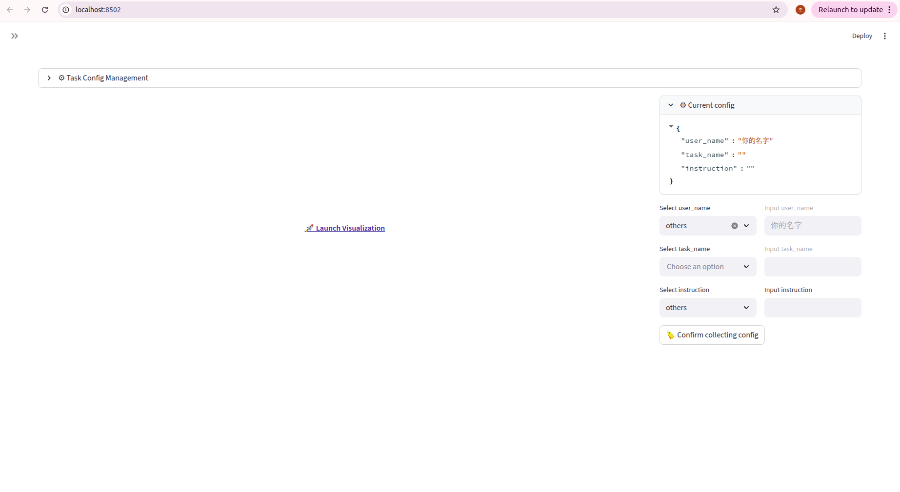
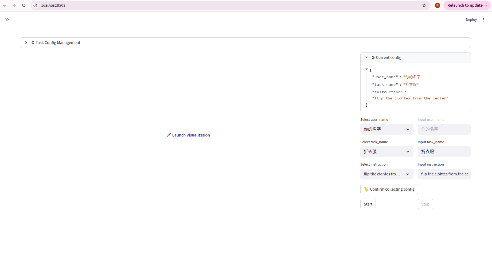

# RoboOrchard Data Recorder Toolkit

RoboOrchard Data Recorder是一套全面而强大的工具套件，专为机器人领域的高保真数据采集而设计，主要面向 ROS 2 生态系统。它提供了一个功能强大且可配置的后端，用于将数据记录为 MCAP 格式，并配备了一个用户友好的 Web 应用程序，用于交互式控制和可视化。

该项目旨在应对复杂、真实的数据采集场景所面临的挑战，提供对数据流的精细控制，确保数据完整性，并简化操作人员的工作流程。

该项目由 [Horizon Robotics] (https://github.com/HorizonRobotics/robo_orchard_data_recorder) 开发，后在原有基础上做了些许改变来适配训练脚本的数据集格式。

## 1. 启动 3个 相机，命名空间必须严格遵守下面的

打开 3个 终端

### 1.1 进入 d435_ws2 目录 并激活环境 (三个都要)

```bash
cd /root/ros2_ws/d435_ws2
source install/setup.bash
```

### 1.2 分别 运行下面三个命令

``` bash
ros2 launch realsense2_camera rs_launch.py \
    camera_namespace:='agilex' \
    camera_name:='middle_camera' \
    align_depth.enable:=true \
    initial_reset:=true \
    diagnostics_period:=2.0 \
    serial_no:="'405622072486'"
```

``` bash
ros2 launch realsense2_camera rs_launch.py \
    camera_namespace:='agilex' \
    camera_name:='left_camera' \
    align_depth.enable:=true \
    initial_reset:=true \
    diagnostics_period:=2.0 \
    serial_no:="'401622072506'"
```

``` bash
ros2 launch realsense2_camera rs_launch.py \
    camera_namespace:='agilex' \
    camera_name:='right_camera' \
    align_depth.enable:=true \
    initial_reset:=true \
    diagnostics_period:=2.0 \
    serial_no:="'405622074908'"
```


## 2. 启动 2个 图像压缩 (/agilex/*_camera/color/image_raw -> /*_camera/color/image_raw/compressed_data) 终端

打开 2个 终端

### 2.1 进入 robo_orchard_data_recorder/example/challenge_cup 目录
```bash
cd /root/ros2_ws/robo_orchard_data_recorder/example/
```

### 2.2 激活环境 (两个都要)
```bash
source /root/ros2_ws/robo_orchard_data_recorder/ros2_package/install/setup.bash
```

### 2.3 分别运行下面两个指令

```bash
bash challenge_cup/launch_image_encoder.sh
```

```bash
bash challenge_cup/launch_depth_encoder.sh
```

## 3. 启动 2个 机械臂

打开 1个 终端

### 3.1 进入 piper_ros 目录并激活环境
```bash
cd /root/ros2_ws/piper_ros
source install/setup.bash
```

### 3.2 找到所有can口 (如果有重新 插拔机械臂 或者 重启主机)
```bash
bash find_all_can_port.sh
```

### 3.3 激活所有 3.2 脚本找到的can口 (如果重启了 机械臂)
```bash
bash can_muti_activate.sh
```

### 3.4 运行机械臂启动脚本
```bash
ros2 launch piper start_multi_arms.launch.py
```

## 4. 启动 静态 TF 发布器

打开 1个 终端

### 4.1 进入 robo_orchard_data_recorder/example/challenge_cup 目录
```bash
cd /root/ros2_ws/robo_orchard_data_recorder/example/
```

### 4.2 激活环境 (两个都要)
```bash
source /root/ros2_ws/robo_orchard_data_recorder/ros2_package/install/setup.bash
```

### 4.3 运行静态TF发布脚本

```bash
bash challenge_cup/launch_static_tf_publisher.sh
```


## 5. 启动 数据采集平台

打开 1个 终端

### 5.1 进入 robo_orchard_data_recorder 目录下 
```bash
cd /root/ros2_ws/robo_orchard_data_recorder/example
```

### 5.2 激活环境
```bash
source /root/ros2_ws/robo_orchard_data_recorder/ros2_package/install/setup.bash
```

### 5.3 启动 采集平台
```bash
bash challenge_cup/launch_app.sh
```


### 5.4 设置本轮采集的用户名



### 5.5 设置本轮采集的数据标签 (后面训练要用到的)


### 5.5 设置本轮采集的数据标签 (后面训练要用到的)


### 5.6 点击 "Confirm collecting config"



### 5.6 采集数据，每次采集点击 start 开启，stop 结束 一个 episode 


---

# 📫 Editor:
 
ASC-RCS
- John Kho (22920232204199@stu.xmu.edu.cn)
- Zhengxuan L. (laizhengxuan@stu.xmu.edu.cn)